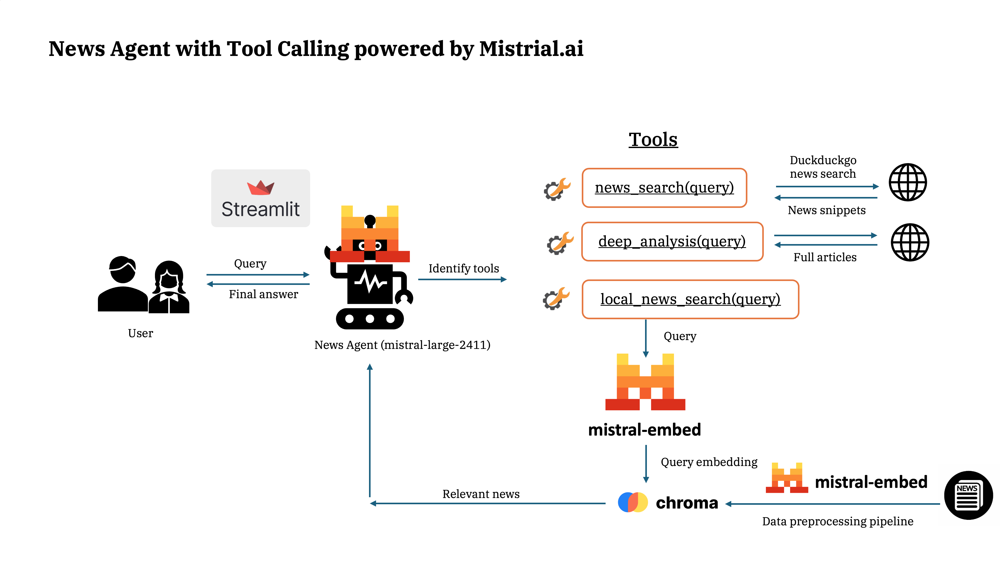

# News Agent

An interactive Streamlit app for searching and analyzing news with sourced answers and optional local vector search (ChromaDB).

## Architecture



## Features
- Web news search with snippets (DuckDuckGo)
- Optional local semantic search via ChromaDB
- Deep analysis mode that reads full articles
- Clean UI with sources sidebar

## Requirements
- Python 3.12
- Streamlit
- duckduckgo_search
- mistralai
- chromadb
- python-dotenv
- docling (for content extraction)

Install dependencies:
```bash
pip install -U streamlit duckduckgo-search mistralai chromadb python-dotenv docling
```

## Environment
Create a `.env` file in the project root and set:
```bash
MISTRAL_API_KEY=your_mistral_api_key
```

## Running the App
```bash
streamlit run news_app/ui.py
```

## Data Pipeline (optional local DB)
- Clean step: `data/1_clean_news.py`
- Load to ChromaDB: `data/2_load_to_chromadb.py`

## Project Layout (high level)
```
YT/News-Agent/
├── data/
│   ├── 1_clean_news.py
│   ├── 2_load_to_chromadb.py
│   └── filtered_english_output.json
├── chroma_db/               # ChromaDB persistent store (created after loading)
├── news_app/
│   └── ui.py                # Streamlit app entry (run this)
├── imgs/
│   └── architecture_diagram.png
├── .gitignore
└── README.md
```